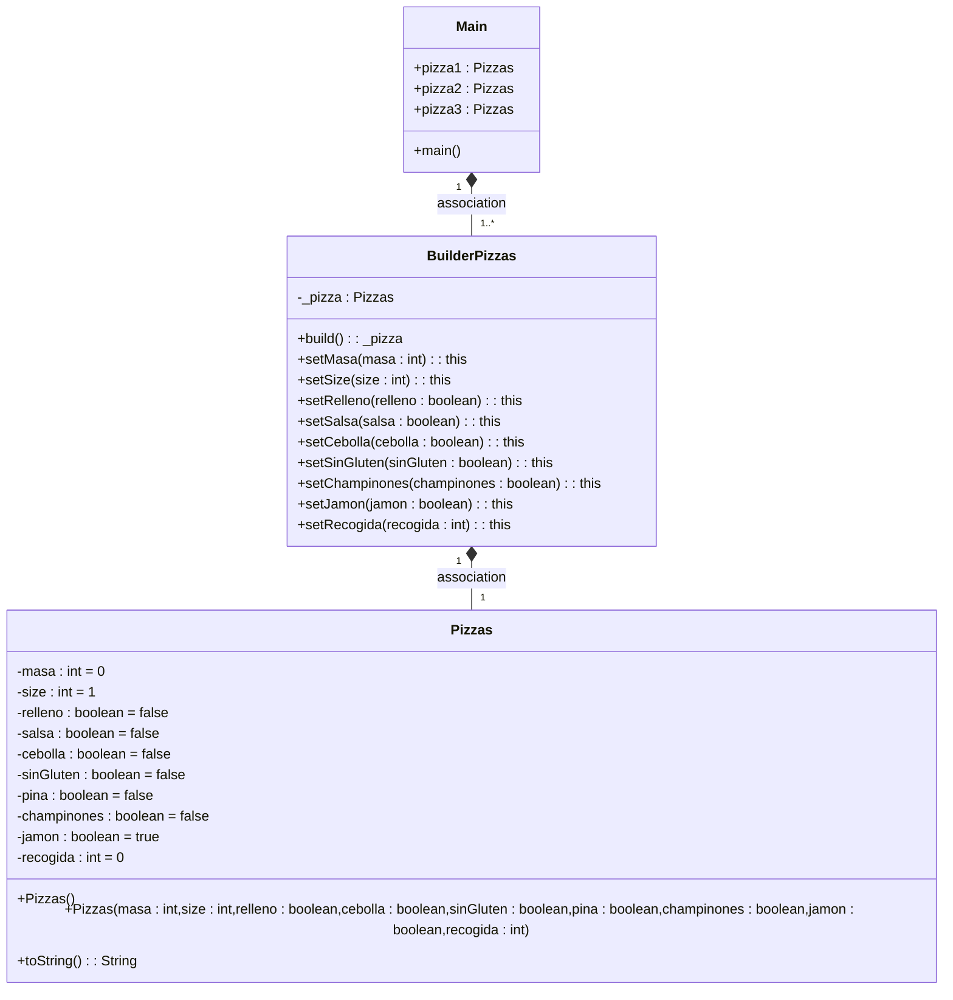

# PATRON BUILDER PIZZA

## ¿Cual es la función de este patrón?

Poder crear objetos iguales o muy similares que son necesarios crear repetitivamente ahorrando código, y permitiendo personalizarlos

## Podríamos combinarlo con el patrón Factory?

Si, podríamos hacer un Factory que dentro de los diferentes tipos de objeto que nos provee,

estos pudiesen ser personalizados mediante el Builder

---
Diagrama de clases
---

