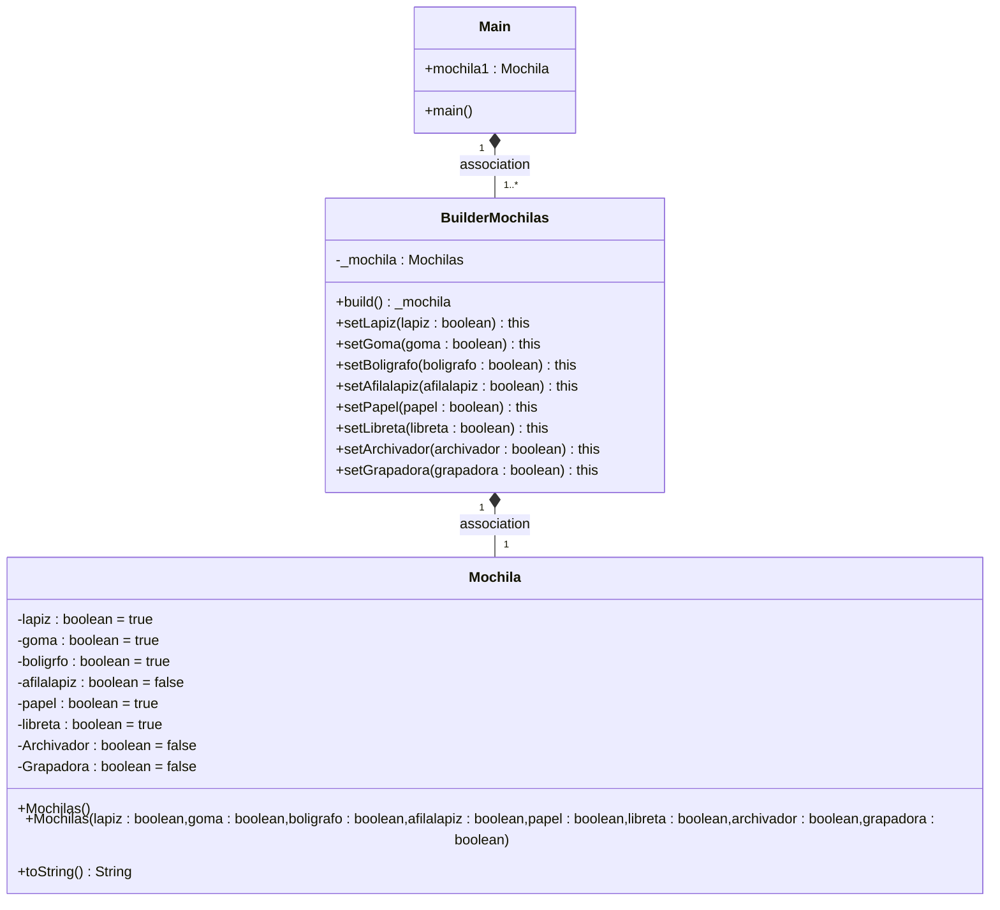

# PATRON BUILDER PIZZA

## ¿Cual es la función de este patrón?

Poder crear objetos iguales o muy similares que son necesarios crear repetitivamente ahorrando código, y permitiendo personalizarlos.

Por ejemplo un Builder que crea un objeto *Mochila*, pero esta mochila puede tener una gran cantidad de atributos, en este caso comprendidos por su aspecto o contenido,
Para el ejemplo usaremos el contenido. 

Su contenido pueden ser, lapiz, goma ,boligrafo, afilalapiz, papel, libreta, archivador, grapadora...

Existen muchos tipos diferentes de mochila resultantes de esto.

Y si quisiesemos crear nosotros ese objeto, tendríamos que especificar gran cantidad de valores para
sus atributos. Aquí es donde entra el Factory, nos permite crear estos objetos, *Mochila* de manera muy sencilla
y pudiendo personalizarlos muy fácilmente.

---
Diagrama de clases
---

## Podríamos combinarlo con el patrón Factory?

Si, podríamos hacer un Factory que dentro de los diferentes tipos de objeto que nos provee,

estos pudiesen ser personalizados mediante el Builder

